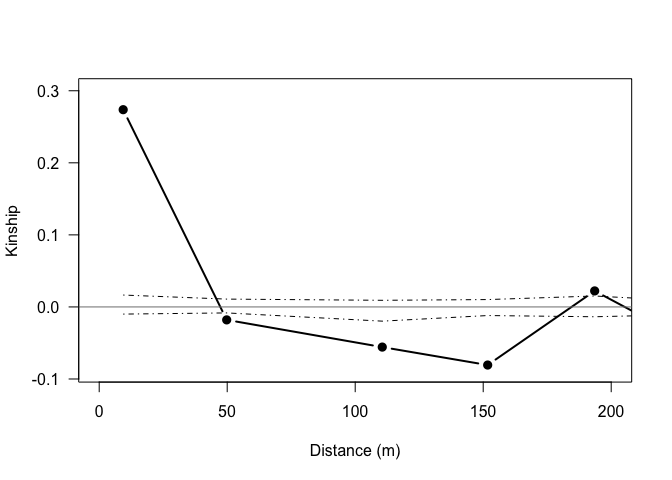

### rSpagedi

*rSpagedi* is a package aimed at interfacing the genetics program SPAGeDi (Spatial Pattern Analysis of Genetic Diversity) with R. The current version of rSpagedi focuses on running analyses of fine-scale spatial genetic structure (FS-SGS).

To find out more about SPAGeDi, please visit the [website.](http://ebe.ulb.ac.be/ebe/SPAGeDi.html)

The main components of rSpagedi are:

1.  Running SPAGeDi analyses in R via the terminal
2.  Reading the output of SPAGeDi analyses into R
3.  Calculating the popular Sp statistic, which estimates the strength of FS-SGS
4.  Creating spatial autocorrelation plots

=============== rSpagedi is very much still in development, and certainly contains many bugs. If you're interested in contributing, have any comments or suggestions, please get in touch via github or email - <lukembrowne@gmail.com> ===============

To install rSpagedi, you must first make sure the package 'devtools' is installed. This will allow you to install rSpagedi directly from github.

``` r

install.packages("devtools")

devtools::install_github("lukembrowne/rSpagedi")
```

=================

Here's an example of a typical workflow...

-   use runSpagedi() to run Spagedi through R
    -   Note that SPAGeDi must be installed on your system!
-   use makeSpagediList() to read back into R in the data file created by the Spagedi run
-   use SpSummary() to calculate Sp statistics
-   use plotAutoCor() to make an autorcorrelation plot

``` r

library(rSpagedi)


## Run SPAGeDi through R console with various options for analysis
# This reads in the SPAGeDi formatted data file located in your working directory, and
# then writes the SPAGeDi output file to your working directory
runSpagedi(input_name = "example_input_file.txt",
           output_name = "output_file.txt", 
           categories_present = TRUE, 
           perm = TRUE, n_perm = 100,
           rest_reg = TRUE, max_regr_dist = 160,
           jackknife = TRUE, 
           ar = FALSE, min_ar = 100)

## Read back in SPAGeDi into R
spagedi_output <- makeSpagediList(path_to_out = "output_file.txt")

## Calculate Sp Statistics
SpSummary(spagedi_output)
#> 
#> 
#> Mean Sp across all loci       ==  0.101427 
#> -------
#> Mean Sp across jacknifed loci ==  0.1011885 
#> -------
#> Sp by loci
#>       Ob03       Ob10       Ob19        Ob4       Ob16       Ob12 
#> 0.10549631 0.11325540 0.11171602 0.03014093 0.08078488 0.12538566 
#>       Ob22       Ob06       Ob07       Ob23       Ob11 
#> 0.10003766 0.13839420 0.13311573 0.15410320 0.04693298

## Create spatial autocorrelation plot
plotAutoCor(spagedi_output, max_dist = 200)
```



=================
